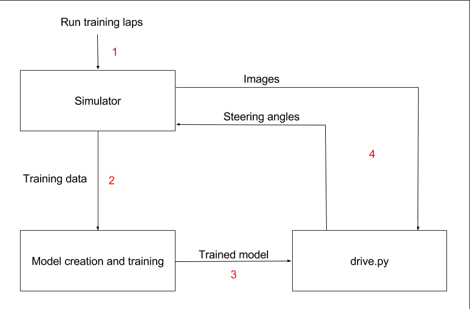
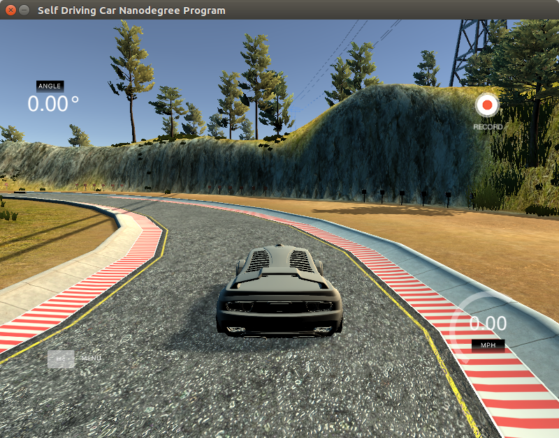
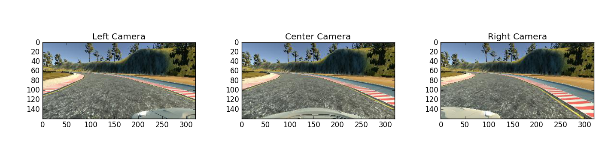
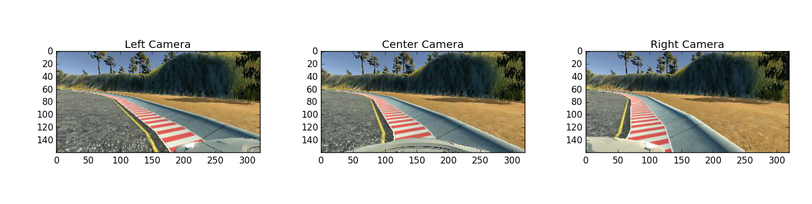
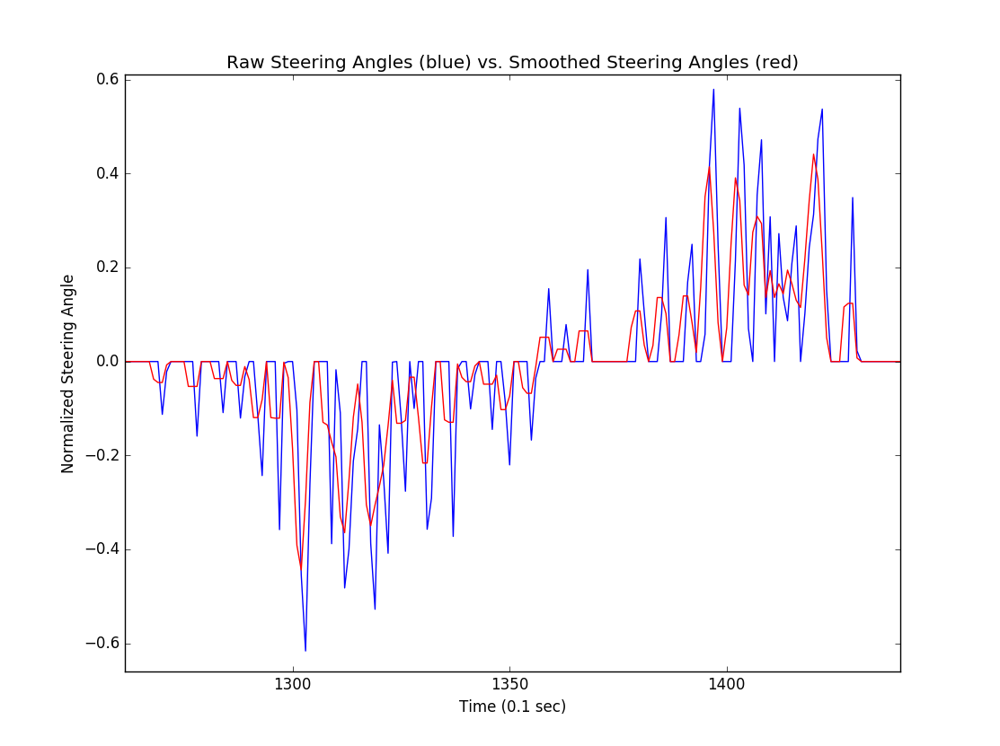
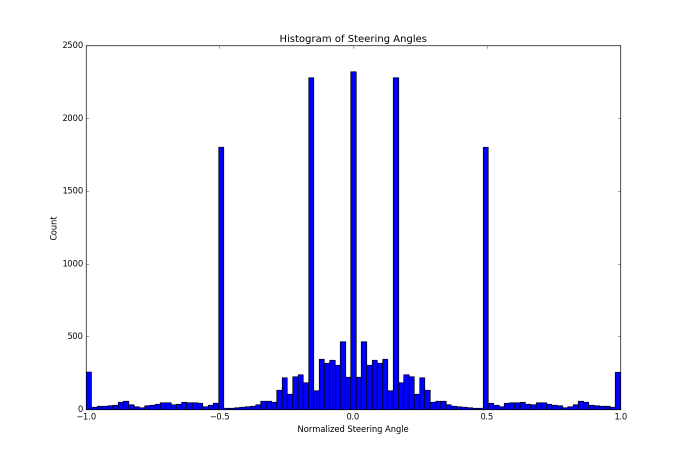
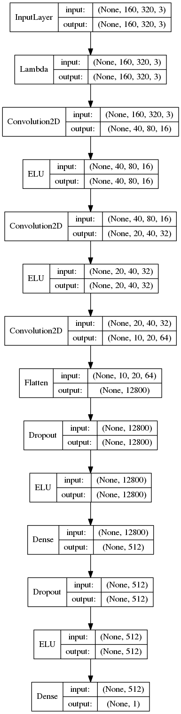
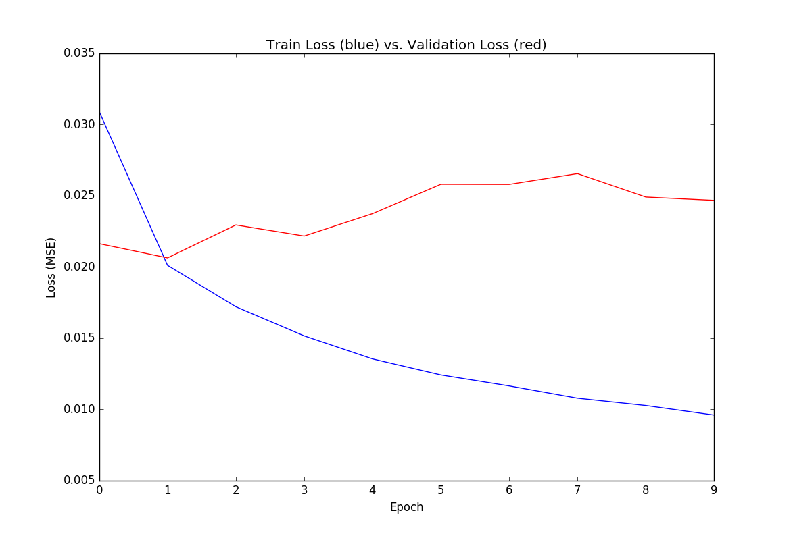

# Behavioral Cloning: Predicting Steering Angles from Camera Images
### Udacity Self-Driving Car Nanodegree

This project performs behavioral cloning, training an AI agent to mimic human driving behavior in a simulator. Training data is collected by a human demonstrator driving around a track in the simulator. Using the vehicle's camera images collected from the human demonstration, we train a deep neural network to predict the vehicle's steering angle. The final trained model is tested on the same test track that was run during the human demonstration. Below is an illustration of the aforementioned process:



During training, the human demonstrator drives the vehicle using his/her keyboard, as in a video game:



Here is a video demonstration of how the trained AI agent performs on the track (fully autonomous):

[https://youtu.be/eHJ6yHTEdBM](https://youtu.be/eHJ6yHTEdBM)

## Dependencies
* Python 3
* TensorFlow
* Keras
* PIL
* Numpy
* h5py
* Scikit Learn
* Pickle
* Udacity behavioral cloning simulator

## Relevant Files
Main files:
* model.py - The script to create and train the model
* drive.py - The script to load the trained model, interface with the simulator, and drive the car
* model.json - The model architecture
* model.h5 - The model weights

Data augmentation and preprocessing:
* flip_raw_images.py - Horizontally flips the training images and updates steering angles accordingly
* create_raw_data.py - Create a dict mapping filename -> (steering angle, camera location), and dump to pickle file
* preprocess_data.py - Preprocess the normal driving data
* preprocess_data_recover.py - Preprocess the recovery driving data
* combine_preprocess_data.py - Merge the data from the above two scripts

## How to Run
First, record your normal driving data in `$NORMAL_DATA_PATH`, left side recovery data in `$LEFT_DATA_PATH`, right side recovery data in `$RIGHT_DATA_PATH`. Also create an empty directory `$MERGE_DATA_PATH`.
`$ROOT` will be your root directory, e.g. the directory to which you cloned this repository.

Data preprocessing:
```
cd $NORMAL_DATA_PATH
python $ROOT/flip_raw_images.py
cd $LEFT_DATA_PATH
python $ROOT/flip_raw_images.py
cd $RIGHT_DATA_PATH
python $ROOT/flip_raw_images.py

cd $MERGE_DATA_PATH
cat $NORMAL_DATA_PATH/driving_log.csv > driving_log_normal.csv
cat $NORMAL_DATA_PATH/driving_log_f.csv >> driving_log_normal.csv
cat $LEFT_DATA_PATH/driving_log.csv > driving_log_left.csv
cat $RIGHT_DATA_PATH/driving_log_f.csv >> driving_log_left.csv
cat $RIGHT_DATA_PATH/driving_log.csv > driving_log_right.csv
cat $LEFT_DATA_PATH/driving_log_f.csv >> driving_log_right.csv
python $ROOT/create_raw_data.py

cd $ROOT
mkdir data
ln -s $MERGE_DATA_PATH/*.p data/
python preprocess_data.py
python preprocess_data_recover.py
python combine_preprocess_data.py
```

To create and train the deep neural network model:
```
python model.py
```

The trained model architecture and weights will be stored in `model.json` and `model.h5`. To run your trained model in the Udacity simulator, first launch the simulator and select "AUTONOMOUS MODE". Then run:
```
python drive.py model.json
```

## Data Collection, Augmentation, and Preprocessing
The training data was collected using Udacity's simulator, in training mode. I only trained on the first track, using keyboard input. Training images were sampled at 10 Hz.

For normal driving data, I drove 3 laps around the track, in the default direction (counter-clockwise looking from the top).

For gathering recovery data, I did the following:

1. Hug the left side of the road, and drive while weaving left and right repeatedly
2. Do (1) for 2 laps
3. Do (1) and (2) while hugging the right side of the road

Below are example images from the left, center, and right cameras, taken from a given point in time during my normal driving training lap:


In contrast, below are images from the recovery training lap, hugging the right side of the road:


For data augmentation, I horizontally flipped all training images and inverted the corresponding steering angles, effectively doubling my data size. Performing the horizontal flip reduces any bias towards turning left, since the test track consists of mostly left turns.

For data preprocessing, I did the following:
* Normal driving data
  * Used center camera image as-is
  * For the left/right camera images, I added an angle offset of +/- 0.15 to the steering angle
    * This serves as "mild" recovery data, helping to keep the vehicle in the center of the road when it deviates slightly
* Recovery data
  * For recovery data hugging the left/right side of the road:
    * I only kept images from the left/right camera
    * I only kept images where the raw steering angle was equal to or greater/less than 0
    * I added an angle offset of +/- 0.5 to the steering angle
      * Note this offset is higher than that of the normal driving data's left/right camera images, because this recovery data signifies a more severe deviation from the center of the road

Since driving data was collected using keyboard inputs, the input time-series is very choppy. To smooth the data, I used a simple moving average, with a window of 3 time units (i.e. 0.3 seconds). Below is a plot of the raw and smoothed steering angle over time, for a random section in my normal driving data:


After performing the data collection, augmentation, and preprocessing steps above, the final distribution of steering angles is visualized in the histogram below:


We can see a large concentration of data with a steering angle of 0, because the vehicle is driving straight much of the time. We also see a large concentration of steering angles at +/- 0.15 and +/- 0.5, because for every center camera image with steering angle 0, we have left and right camera images with the pre-determined steering angle offset.

Also notice that we have an even distribution between positive and negative steering angles, because we horizontally flipped all input images.

## Deriving and Designing a Model Architecture
Since the task of predicting steering angles from an input image is a computer vision task, a convolutional neural network (CNN) architecture is most appropriate. There has been prior work done to predict vehicle steering angles from camera images, such as NVIDIA's "End to End Learning for Self-Driving Cars" (http://images.nvidia.com/content/tegra/automotive/images/2016/solutions/pdf/end-to-end-dl-using-px.pdf), and comma.ai's steering angle prediction model (https://github.com/commaai/research/blob/master/train_steering_model.py). A transfer learning approach is also feasible, for example leveraging the base layers of an ImageNet pre-trained VGG16 model, and training a custom regression head.

In this project, I chose to use comma.ai's model, and train it from scratch using the data I've collected. The comma.ai model is a simple model, and its source code is available on Github. Initially I experimented with a transfer learning approach using an ImageNet pre-trianed VGG16 base model, but I have yet to achieve good results with this approach.

The comma.ai CNN model I used consists of the following layers:
* Data normalization layer: Scale all image pixel values within the range [-1, 1], via the following operation: `x/127.5 - 1.`
* Convolution with 8x8 kernel, stride of 4, depth of 16, same padding
* ELU activation
* Convolution with 5x5 kernel, stride of 2, depth of 32, same padding
* ELU activation
* Convolution with 5x5 kernel, stride of 2, depth of 64, same padding
* Dropout with 0.2 drop probability
* ELU activation
* Fully-connected with 512 hidden units, ELU activation
* Dropout with 0.5 drop probability
* ELU activation
* Fully-connected with 1 unit (steering angle output)

The CNN model has 5 trainable layers, and 6,621,809 trainable parameters. The model follows the standard design practice for CNNs: the base convolutional layers' height and width progressively decrease while its depth increases, and the final layers are a series of fully-connected layers. Dropout layers were included right before the fully-connected layers, to help reduce overfitting.

Below is a visualization of the CNN model used. Note the Lambda layer is the data normalization layer.


## Training Process and Parameter Tuning
After the data was prepared as described above, the first step of the training process was to perform a train/validation split. I chose a split of 90% training data and 10% validation data, since I had relatively little data to work with (roughly 19,000 images after data augmentation and filtering). Note that a "test set" was not necessary, because the purpose of a test set is to measure the model's generalization capability after the model has been finalized, and this purpose is fullfilled by running the final model on the test track in simulation.

Since it is impractical to store all images in memory, a python generator was used to generate batches of data. Thus, only a list of filenames of the entire training and validation set were stored in memory, and the images themselves were read from disk only when new batch was requested.

An adam optimizer (https://arxiv.org/abs/1412.6980v8) was used to minimize the mean squared error (MSE). The optimizer's learning rate was not extensively tuned, but I found a learning rate of 1e-4 produced stable results. The loss function was MSE because predicting steering angles is a regression problem.

For regularization, the comma.ai model already specified dropout layers and their associated drop probabilities, and I used those values as-is. I attempted to add L2 regularization to the model, but empirical results on the test track were worse, so I excluded L2 regularization in the final model.

The model was trained over 10 epochs, with a batch size of 16. Below is a plot of the training and validation losses over epochs:


We can see the training loss decreasing, but validation loss remained roughly the same. I tried adding L2 regularization to the model to improve validation loss, but empirical results in simulation were worse, so I did not include L2 regularization in the final model. However, without L2 regularization, the validation loss did not increase over time, which means the model is at least not grossly overfitting.

## Future Enhancements/Experiments
As seen in the video demonstration of the AI agent, its driving behavior could be smoother. Also, the AI agent is unable to complete the second track in the simulator. Potential future enhancements/experiments to improve the AI agent include the following:

* Use a different training dataset, such as Udacity's official training dataset
* Try to use NVIDIA's model architecture presented in "End to End Learning for Self-Driving Cars" (http://images.nvidia.com/content/tegra/automotive/images/2016/solutions/pdf/end-to-end-dl-using-px.pdf)
* Try a transfer learning approach, using pre-trained networks such as VGG16, ResNet50, InceptionV3, etc.
  * Also try fine-tuning the later base convolution layers
* Create a new CNN architecture
* Test different hyper-parameters, such as learning rate, dropout probability, steering angle offsets, etc.
